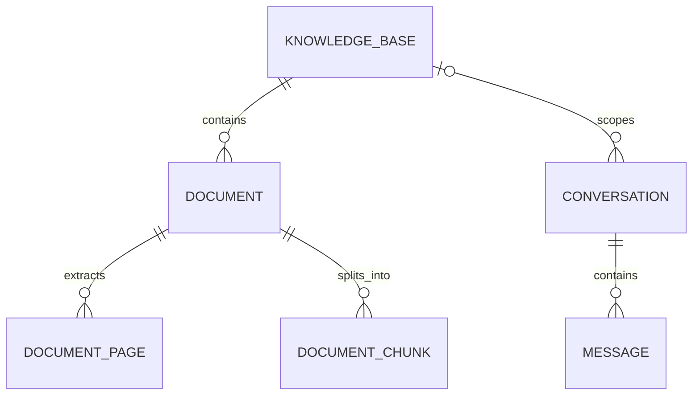

# 智能故障诊断助手

基于 RAG 的设备故障诊断系统，支持维修手册解析、混合检索、引用溯源、
多轮故障诊断和结构化排查建议。

## 当前功能

- FastAPI 后端基础结构
- 环境变量配置
- 统一 API 响应格式
- 统一异常处理
- 健康检查接口
- SQLAlchemy 2 异步数据库访问
- Alembic 数据库版本迁移
- 知识库创建、分页、详情、更新和删除接口
- 知识库、文档、切片、会话和消息核心数据模型
- PDF、DOCX、TXT、Markdown 文件上传与文本解析
- 文件大小与扩展名校验、SHA-256 内容去重、安全文件名和隔离存储
- 文档解析状态、按页原文查看和失败原因记录
- Markdown 标题感知与通用递归文本分块
- 可配置切片长度、重叠长度、最小切片长度和重新分块
- 切片页码、章节标题、策略参数和估算Token数追踪
- FastEmbed 本地中文向量化（BAAI/bge-small-zh-v1.5）
- Qdrant 本地持久化向量索引和知识库级语义检索
- SQLite切片上的BM25关键词检索、向量/BM25双路召回和RRF结果融合
- SiliconFlow中文重排模型，可关闭、可替换，调用失败时自动回退到RRF结果
- 检索评估集、三种检索方案自动对比及Hit Rate、Recall、MRR、nDCG和延迟指标
- 文档索引重建、删除与重新分块时的向量同步清理
- OpenAI兼容大模型接口和可替换模型配置
- 基于检索原文的结构化故障诊断、资料编号引用和Token用量返回
- 无有效检索资料时跳过大模型，避免无依据生成和额外费用
- Prompt注入防护、资料不足声明和工业维修安全约束
- 诊断会话创建、查询、改名和删除
- 多轮消息历史、首问自动标题、追问检索增强和回答引用持久化
- 单轮与多轮SSE流式回答、命名事件协议和完成后原子落库
- 接口与数据库隔离测试

## 数据模型



- 删除知识库时，其文档和切片会级联删除。
- 删除知识库后，历史诊断会话仍然保留，知识库关联被置空。
- 删除会话时，其消息会级联删除。

## 本地运行

```powershell
conda activate fault-rag
Set-Location "D:\python project\rag"
python -m pip install -r backend/requirements-dev.txt
python -m alembic -c backend/alembic.ini upgrade head
python -m uvicorn app.main:app --app-dir backend --reload
```

启动后访问：

- Swagger: <http://127.0.0.1:8000/docs>
- 健康检查: <http://127.0.0.1:8000/api/v1/health>

## 前端工作台

前端位于 `frontend`，提供知识库选择与创建、文档上传和索引、历史诊断会话、SSE流式回答
以及引用原文查看。先启动上述FastAPI服务，再打开另一个PowerShell窗口：

```powershell
conda activate fault-rag
Set-Location "D:\python project\rag\frontend"
npm install
npm run dev
```

访问 <http://localhost:3000>。前端默认连接 `http://127.0.0.1:8000/api/v1`；如后端地址
不同，复制 `frontend/.env.example` 为 `frontend/.env.local` 并修改
`NEXT_PUBLIC_API_BASE_URL`。后端允许的前端来源由根目录 `.env` 中的JSON数组配置：

```text
CORS_ORIGINS=["http://127.0.0.1:3000","http://localhost:3000"]
```

构建与检查：

```powershell
Set-Location "D:\python project\rag\frontend"
npm run lint
npx tsc --noEmit
npm run build
```

## 知识库接口

| 方法 | 路径 | 说明 |
| --- | --- | --- |
| `POST` | `/api/v1/knowledge-bases` | 创建知识库 |
| `GET` | `/api/v1/knowledge-bases` | 分页查询知识库 |
| `GET` | `/api/v1/knowledge-bases/{id}` | 查询知识库详情 |
| `PATCH` | `/api/v1/knowledge-bases/{id}` | 更新知识库 |
| `DELETE` | `/api/v1/knowledge-bases/{id}` | 删除知识库 |

## 文档接口

| 方法 | 路径 | 说明 |
| --- | --- | --- |
| `POST` | `/api/v1/knowledge-bases/{id}/documents` | 上传并解析文档 |
| `GET` | `/api/v1/knowledge-bases/{id}/documents` | 分页查询知识库文档 |
| `GET` | `/api/v1/documents/{id}` | 查询文档详情与处理状态 |
| `GET` | `/api/v1/documents/{id}/content` | 分页查看按页解析文本 |
| `POST` | `/api/v1/documents/{id}/chunks` | 生成或重建文档切片 |
| `GET` | `/api/v1/documents/{id}/chunks` | 分页查看文档切片 |
| `DELETE` | `/api/v1/documents/{id}/chunks` | 删除切片并恢复为已解析状态 |
| `POST` | `/api/v1/documents/{id}/index` | 将文档切片向量化并写入Qdrant |
| `DELETE` | `/api/v1/documents/{id}/index` | 删除文档向量并恢复为已分块状态 |
| `DELETE` | `/api/v1/documents/{id}` | 删除文档、原始文件和解析内容 |

## 检索与问答接口

| 方法 | 路径 | 说明 |
| --- | --- | --- |
| `POST` | `/api/v1/knowledge-bases/{id}/search` | 在指定知识库内检索语义相关切片 |
| `POST` | `/api/v1/knowledge-bases/{id}/ask` | 检索资料并生成带引用的诊断答案 |
| `POST` | `/api/v1/knowledge-bases/{id}/ask/stream` | 流式生成单轮诊断答案 |
| `POST` | `/api/v1/knowledge-bases/{id}/evaluations/retrieval` | 批量评估并对比检索方案 |

## 诊断会话接口

| 方法 | 路径 | 说明 |
| --- | --- | --- |
| `POST` | `/api/v1/conversations` | 创建诊断会话 |
| `GET` | `/api/v1/conversations` | 分页查询会话，可按知识库过滤 |
| `GET` | `/api/v1/conversations/{id}` | 查询会话详情 |
| `PATCH` | `/api/v1/conversations/{id}` | 修改会话标题 |
| `DELETE` | `/api/v1/conversations/{id}` | 删除会话及其全部消息 |
| `GET` | `/api/v1/conversations/{id}/messages` | 分页查询会话消息 |
| `POST` | `/api/v1/conversations/{id}/messages` | 发送消息并生成多轮RAG回答 |
| `POST` | `/api/v1/conversations/{id}/messages/stream` | 发送消息并流式生成多轮回答 |

支持的文件格式：

- PDF：使用 PyMuPDF 按页提取文本
- DOCX：使用 python-docx 提取段落和表格文本
- TXT、Markdown：支持 UTF-8、UTF-8 BOM 和 GB18030 编码

默认文件大小上限为 20 MB，可通过 `MAX_UPLOAD_SIZE_BYTES` 修改。原始文件存放在
`UPLOAD_DIR` 指定目录，同一知识库内按 SHA-256 内容哈希去重。扫描版 PDF 当前不会
执行 OCR，会被标记为 `failed` 并记录失败原因。

文档处理状态：

```text
pending → parsing → parsed → chunking → chunked → indexing → indexed
                    └──────────┴───────────┴──────────→ failed
```

当前上传请求会同步完成文本解析。后续生产化阶段可以将 `parsing` 部分迁移到任务队列，
接口、数据库状态和解析服务不需要重新设计。

## 文本分块

默认参数：

```text
chunk_size       = 700 字符
chunk_overlap    = 100 字符
min_chunk_size   = 80 字符
```

Markdown文档优先按 `#` 到 `######` 标题划分语义章节，并把当前章节标题保留在对应切片中。
分块器也会在元数据中记录完整标题路径。实验表明把全部父标题写入切片会提高部分召回、同时
降低部分重排效果，因此默认 `MARKDOWN_INCLUDE_HEADING_PATH=false`；开启后重新分块才生效。
其他格式优先按照段落、换行、句号、问号、分号等边界递归切分，最后才使用固定字符长度。
纯标题和空白内容不会生成切片。

生成切片：

```http
POST /api/v1/documents/{document_id}/chunks
Content-Type: application/json

{
  "chunk_size": 700,
  "chunk_overlap": 100,
  "min_chunk_size": 80
}
```

重复调用该接口会原子替换旧切片，方便比较不同参数。每条切片保留原始页码、章节标题、
分块策略和参数。当前 `token_count` 是轻量估算值。

## 向量索引与混合检索

项目默认使用 `BAAI/bge-small-zh-v1.5` 将切片转换为 512 维向量，并把向量写入本地
Qdrant。首次建立索引时 FastEmbed 会下载模型文件，之后会复用本机缓存。

```text
                         ┌→ Qdrant向量召回 ─┐
用户问题 → 候选切片召回 ┤                  ├→ RRF融合 → Reranker重排 → Top K
                         └→ SQLite BM25 ───┘
```

- SQLite 是业务数据源，保存知识库、文档、完整切片以及处理状态。
- Qdrant 保存切片向量和 `chunk_id`、`document_id`、`knowledge_base_id`、页码等定位字段。
- 向量召回负责理解近义表达，BM25负责精确匹配故障码、型号和专业术语。
- 两路候选使用RRF按排名融合，不要求两种检索分数处于同一量纲。
- 融合结果默认交给SiliconFlow的Reranker做精排；服务异常时自动使用RRF结果继续回答。
- 最终根据切片ID从SQLite读取完整内容，并返回每一路的分数和命中来源。
- 搜索条件强制包含知识库ID，避免不同知识库的数据混在一起。
- 已索引文档重新分块、删除切片、删除文档或删除知识库时，会同步清理旧向量。

为文档建立索引：

```http
POST /api/v1/documents/{document_id}/index
```

执行语义检索：

```http
POST /api/v1/knowledge-bases/{knowledge_base_id}/search
Content-Type: application/json

{
  "query": "空压机排气温度过高怎么排查？",
  "top_k": 5,
  "score_threshold": 0.3,
  "retrieval_mode": "hybrid",
  "rerank": true
}
```

`retrieval_mode` 可取 `hybrid`（默认）或 `vector`。设置为 `vector` 且将 `rerank`
设为 `false`，可以与原始向量检索做效果对比。响应会返回 `vector_score`、
`keyword_score`、`fusion_score`、`rerank_score`、`retrieval_sources` 以及本次是否真正执行重排。

本地开发默认把向量文件放在项目根目录 `qdrant_storage`。相关环境变量：

```text
EMBEDDING_MODEL_NAME=BAAI/bge-small-zh-v1.5
EMBEDDING_DIMENSION=512
EMBEDDING_BATCH_SIZE=32
QDRANT_PATH=qdrant_storage
QDRANT_COLLECTION=fault_diagnosis_chunks
QDRANT_URL=
RETRIEVAL_CANDIDATE_MULTIPLIER=4
RRF_K=60
```

生产环境部署独立Qdrant后，只需设置 `QDRANT_URL`，如有鉴权再设置
`QDRANT_API_KEY`；留空 `QDRANT_URL` 时使用本地持久化模式。

## RAG检索效果评估

项目可以在同一组人工标注问题上自动对比以下三种检索方案：

```text
vector          = 纯向量检索
hybrid_rrf      = 向量 + BM25 + RRF
hybrid_rerank   = 向量 + BM25 + RRF + Reranker
```

先通过 `GET /api/v1/documents/{document_id}/chunks?page_size=100` 查看文档切片，人工为每个
问题选择真正相关的 `chunk_id`，形成评估集。项目提供了
[`sample_evaluations/air_compressor_retrieval.sample.json`](sample_evaluations/air_compressor_retrieval.sample.json)
作为格式参考，其中的示例UUID必须替换为当前知识库的真实切片ID。

执行评估：

```http
POST /api/v1/knowledge-bases/{knowledge_base_id}/evaluations/retrieval
Content-Type: application/json

{
  "cases": [
    {
      "case_id": "compressor-e101-001",
      "query": "空压机E101高温停机应该先检查什么？",
      "relevant_chunk_ids": ["真实相关切片UUID"]
    }
  ],
  "top_k": 5,
  "score_threshold": null
}
```

接口返回每条问题的检索排名与以下聚合指标：

| 指标 | 含义 |
| --- | --- |
| `hit_rate_at_k` | 前K条中至少命中一个相关切片的问题比例 |
| `precision_at_k` | 前K条结果中相关切片所占比例 |
| `recall_at_k` | 人工标注的相关切片被召回的比例 |
| `mrr` | 第一个相关切片排名倒数的平均值，越接近1越靠前 |
| `ndcg_at_k` | 综合考虑多个相关切片及其排名位置的归一化分数 |
| `average_latency_ms` / `p95_latency_ms` | 平均耗时和95分位耗时 |

响应中的 `best_variant` 优先按MRR、Recall和nDCG选择表现最好的方案，在质量相同时选择
平均延迟更低的方案。评估集中的切片必须属于当前知识库且文档已经建立索引，否则接口会
拒绝评估，避免错误标注产生虚假指标。默认包含Reranker方案，因此使用真实配置运行时会
调用Rerank服务；如只想比较本地检索，可在请求的 `variants` 中排除该方案。

## RAG故障诊断问答

`/ask` 接口在语义检索之上增加了提示词组装和大模型生成：

```text
故障问题 → 混合召回 → RRF融合 → Reranker重排 → SQLite原文回查
         → 编号资料上下文 → 大模型生成 → 结构化诊断答案 + 可追溯来源
```

诊断Prompt要求模型只依据知识库资料回答，在关键结论后使用 `[资料1]`、`[资料2]`
标注来源，并按照“初步判断、可能原因、排查步骤、安全提醒”组织答案。知识库文档会被
标记为不可信上下文，资料中的角色切换、提示词泄露或命令执行要求不会被当成系统指令。
如果检索不到达到阈值的资料，服务不会调用收费模型，而是直接返回信息不足提示。

项目调用兼容 Chat Completions 协议的流式与非流式接口。默认配置使用硅基流动提供的
DeepSeek模型，也可以通过相同环境变量切换到其他兼容服务。复制配置文件并填写自己的Key：

```powershell
Copy-Item .env.example .env
```

```text
LLM_BASE_URL=https://api.siliconflow.cn/v1
LLM_MODEL_NAME=deepseek-ai/DeepSeek-V4-Flash
LLM_API_KEY=填写自己的API_KEY
LLM_TIMEOUT_SECONDS=60
LLM_TEMPERATURE=0.2
LLM_MAX_TOKENS=1200
RAG_MAX_CONTEXT_CHARS=12000
CONVERSATION_HISTORY_MESSAGES=10
RERANKER_ENABLED=true
RERANKER_BASE_URL=https://api.siliconflow.cn/v1
RERANKER_MODEL_NAME=BAAI/bge-reranker-v2-m3
RERANKER_API_KEY=
RERANKER_TIMEOUT_SECONDS=30
```

`RERANKER_API_KEY` 留空时会复用 `LLM_API_KEY`。关闭 `RERANKER_ENABLED` 或在请求中传入
`"rerank": false`，服务会直接使用RRF融合结果，不调用重排接口。

`.env` 已被 Git 忽略，禁止将真实Key写入 `.env.example` 或提交到仓库。

生成诊断答案：

```http
POST /api/v1/knowledge-bases/{knowledge_base_id}/ask
Content-Type: application/json

{
  "question": "空压机E101高温停机应该怎么排查？",
  "top_k": 5,
  "score_threshold": 0.3,
  "retrieval_mode": "hybrid",
  "rerank": true
}
```

响应中的 `answer` 是模型生成的诊断建议，`sources` 包含引用编号、原始切片、文件名、
页码、章节和相似度，`usage` 包含本次生成的Token用量。调用前需要保证知识库中的文档
已经完成分块和向量索引。

## 多轮故障诊断

创建会话时绑定一个知识库：

```http
POST /api/v1/conversations
Content-Type: application/json

{
  "knowledge_base_id": "知识库UUID",
  "title": "新诊断"
}
```

向会话发送第一轮故障问题：

```http
POST /api/v1/conversations/{conversation_id}/messages
Content-Type: application/json

{
  "question": "空压机E101高温停机应该怎么排查？",
  "top_k": 5,
  "score_threshold": 0.3
}
```

继续调用同一接口即可追问，例如“那第二步具体检查什么？”。服务会把最近
`CONVERSATION_HISTORY_MESSAGES` 条消息发送给模型，并把最近两个用户问题与当前问题
组合后再做混合检索，避免省略设备或故障名称的追问失去语义。每轮用户消息、助手回答、
引用原文快照都会保存到 SQLite；首次提问会自动把默认标题“新诊断”替换为问题摘要。

删除知识库后历史会话仍然保留，`knowledge_base_id` 被置空，已有消息可以继续查看，但该
会话不能再生成新的知识库诊断回答。

## SSE流式回答

流式接口使用 `text/event-stream` 返回UTF-8 JSON事件：

| 事件 | 含义 |
| --- | --- |
| `retrieval_started` | 开始混合检索知识库 |
| `sources` | 返回本次回答使用的编号资料 |
| `answer_delta` | 返回一段新增的模型正文 |
| `completed` | 回答完整结束，包含完整正文、模型和Token统计 |
| `error` | 检索、模型调用或消息保存失败 |

多轮流的 `completed` 事件还包含 `conversation_id`、`user_message_id` 和
`assistant_message_id`。只有收到上游模型的完整回答后，用户消息、助手消息和引用才会在
同一事务中写入SQLite；模型流中断或客户端取消请求时不会保存半截答案。

PowerShell测试示例：

```powershell
curl.exe -N -X POST `
  "http://127.0.0.1:8000/api/v1/conversations/{conversation_id}/messages/stream" `
  -H "Content-Type: application/json" `
  -d '{"question":"空压机E101高温停机怎么排查？","top_k":5,"score_threshold":0.3}'
```

返回格式示例：

```text
event: retrieval_started
data: {"question":"空压机E101高温停机怎么排查？","top_k":5}

event: sources
data: {"items":[...]}

event: answer_delta
data: {"delta":"### 初步判断\n"}

event: completed
data: {"answer":"完整回答...","llm_called":true,"usage":{...}}
```

这些是POST流式接口，浏览器前端应使用 `fetch()` 读取响应流，而不是只能发GET请求的原生
`EventSource`。接口在开始输出前仍可正常返回404或409；流开始后的错误通过 `error` 事件
表达。响应同时设置禁用缓存和Nginx代理缓冲的响应头。

当前默认使用项目根目录下的 SQLite 数据库 `fault_rag.db`。该文件已被 Git 忽略，
后续部署阶段会通过 `DATABASE_URL` 切换到 PostgreSQL。

当前BM25实现会在查询时读取指定知识库内已索引的切片，适合作品集演示和中小规模知识库。
如果以后扩展到大量文档，可迁移到Elasticsearch/OpenSearch或Qdrant稀疏向量检索，API层
和RRF融合流程无需整体推翻。

## 数据库迁移

应用已有迁移：

```powershell
python -m alembic -c backend/alembic.ini current
python -m alembic -c backend/alembic.ini history
```

修改 ORM 模型后创建并应用迁移：

```powershell
python -m alembic -c backend/alembic.ini revision --autogenerate -m "describe change"
python -m alembic -c backend/alembic.ini upgrade head
```

## 测试与代码检查

```powershell
python -m pytest
python -m ruff check .
python -m ruff format --check .
```
