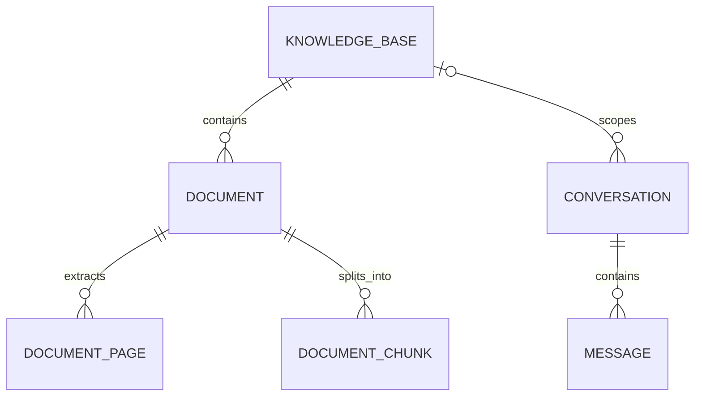

# 智能故障诊断助手

基于 RAG 的设备故障诊断系统。项目将逐步支持维修手册解析、混合检索、引用溯源、
多轮故障诊断和结构化排查建议。

## 当前功能

- FastAPI 后端基础结构
- 环境变量配置
- 统一 API 响应格式
- 统一异常处理
- 健康检查接口
- SQLAlchemy 2 异步数据库访问
- Alembic 数据库版本迁移
- 知识库创建、分页、详情、更新和删除接口
- 知识库、文档、切片、会话和消息核心数据模型
- PDF、DOCX、TXT、Markdown 文件上传与文本解析
- 文件大小与扩展名校验、SHA-256 内容去重、安全文件名和隔离存储
- 文档解析状态、按页原文查看和失败原因记录
- Markdown 标题感知与通用递归文本分块
- 可配置切片长度、重叠长度、最小切片长度和重新分块
- 切片页码、章节标题、策略参数和估算Token数追踪
- FastEmbed 本地中文向量化（BAAI/bge-small-zh-v1.5）
- Qdrant 本地持久化向量索引和知识库级语义检索
- 文档索引重建、删除与重新分块时的向量同步清理
- 接口与数据库隔离测试

## 数据模型



- 删除知识库时，其文档和切片会级联删除。
- 删除知识库后，历史诊断会话仍然保留，知识库关联被置空。
- 删除会话时，其消息会级联删除。

## 本地运行

```powershell
conda activate fault-rag
Set-Location "D:\python project\rag"
python -m pip install -r backend/requirements-dev.txt
python -m alembic -c backend/alembic.ini upgrade head
python -m uvicorn app.main:app --app-dir backend --reload
```

启动后访问：

- Swagger: <http://127.0.0.1:8000/docs>
- 健康检查: <http://127.0.0.1:8000/api/v1/health>

## 知识库接口

| 方法 | 路径 | 说明 |
| --- | --- | --- |
| `POST` | `/api/v1/knowledge-bases` | 创建知识库 |
| `GET` | `/api/v1/knowledge-bases` | 分页查询知识库 |
| `GET` | `/api/v1/knowledge-bases/{id}` | 查询知识库详情 |
| `PATCH` | `/api/v1/knowledge-bases/{id}` | 更新知识库 |
| `DELETE` | `/api/v1/knowledge-bases/{id}` | 删除知识库 |

## 文档接口

| 方法 | 路径 | 说明 |
| --- | --- | --- |
| `POST` | `/api/v1/knowledge-bases/{id}/documents` | 上传并解析文档 |
| `GET` | `/api/v1/knowledge-bases/{id}/documents` | 分页查询知识库文档 |
| `GET` | `/api/v1/documents/{id}` | 查询文档详情与处理状态 |
| `GET` | `/api/v1/documents/{id}/content` | 分页查看按页解析文本 |
| `POST` | `/api/v1/documents/{id}/chunks` | 生成或重建文档切片 |
| `GET` | `/api/v1/documents/{id}/chunks` | 分页查看文档切片 |
| `DELETE` | `/api/v1/documents/{id}/chunks` | 删除切片并恢复为已解析状态 |
| `POST` | `/api/v1/documents/{id}/index` | 将文档切片向量化并写入Qdrant |
| `DELETE` | `/api/v1/documents/{id}/index` | 删除文档向量并恢复为已分块状态 |
| `DELETE` | `/api/v1/documents/{id}` | 删除文档、原始文件和解析内容 |

## 语义检索接口

| 方法 | 路径 | 说明 |
| --- | --- | --- |
| `POST` | `/api/v1/knowledge-bases/{id}/search` | 在指定知识库内检索语义相关切片 |

支持的文件格式：

- PDF：使用 PyMuPDF 按页提取文本
- DOCX：使用 python-docx 提取段落和表格文本
- TXT、Markdown：支持 UTF-8、UTF-8 BOM 和 GB18030 编码

默认文件大小上限为 20 MB，可通过 `MAX_UPLOAD_SIZE_BYTES` 修改。原始文件存放在
`UPLOAD_DIR` 指定目录，同一知识库内按 SHA-256 内容哈希去重。扫描版 PDF 当前不会
执行 OCR，会被标记为 `failed` 并记录失败原因。

文档处理状态：

```text
pending → parsing → parsed → chunking → chunked → indexing → indexed
                    └──────────┴───────────┴──────────→ failed
```

当前上传请求会同步完成文本解析。后续生产化阶段可以将 `parsing` 部分迁移到任务队列，
接口、数据库状态和解析服务不需要重新设计。

## 文本分块

默认参数：

```text
chunk_size       = 700 字符
chunk_overlap    = 100 字符
min_chunk_size   = 80 字符
```

Markdown文档优先按 `#` 到 `######` 标题划分语义章节，并把章节标题保留在对应切片中。
其他格式优先按照段落、换行、句号、问号、分号等边界递归切分，最后才使用固定字符长度。
纯标题和空白内容不会生成切片。

生成切片：

```http
POST /api/v1/documents/{document_id}/chunks
Content-Type: application/json

{
  "chunk_size": 700,
  "chunk_overlap": 100,
  "min_chunk_size": 80
}
```

重复调用该接口会原子替换旧切片，方便比较不同参数。每条切片保留原始页码、章节标题、
分块策略和参数。当前 `token_count` 是轻量估算值。

## 向量索引与语义检索

项目默认使用 `BAAI/bge-small-zh-v1.5` 将切片转换为 512 维向量，并把向量写入本地
Qdrant。首次建立索引时 FastEmbed 会下载模型文件，之后会复用本机缓存。

```text
用户问题 → 查询向量 → Qdrant相似度检索 → 切片ID → SQLite读取完整切片
```

- SQLite 是业务数据源，保存知识库、文档、完整切片以及处理状态。
- Qdrant 保存切片向量和 `chunk_id`、`document_id`、`knowledge_base_id`、页码等定位字段。
- 检索先在 Qdrant 找到最相似的切片，再根据切片ID从 SQLite读取完整内容。
- 搜索条件强制包含知识库ID，避免不同知识库的数据混在一起。
- 已索引文档重新分块、删除切片、删除文档或删除知识库时，会同步清理旧向量。

为文档建立索引：

```http
POST /api/v1/documents/{document_id}/index
```

执行语义检索：

```http
POST /api/v1/knowledge-bases/{knowledge_base_id}/search
Content-Type: application/json

{
  "query": "空压机排气温度过高怎么排查？",
  "top_k": 5,
  "score_threshold": 0.3
}
```

本地开发默认把向量文件放在项目根目录 `qdrant_storage`。相关环境变量：

```text
EMBEDDING_MODEL_NAME=BAAI/bge-small-zh-v1.5
EMBEDDING_DIMENSION=512
EMBEDDING_BATCH_SIZE=32
QDRANT_PATH=qdrant_storage
QDRANT_COLLECTION=fault_diagnosis_chunks
QDRANT_URL=
```

生产环境部署独立Qdrant后，只需设置 `QDRANT_URL`，如有鉴权再设置
`QDRANT_API_KEY`；留空 `QDRANT_URL` 时使用本地持久化模式。

当前默认使用项目根目录下的 SQLite 数据库 `fault_rag.db`。该文件已被 Git 忽略，
后续部署阶段会通过 `DATABASE_URL` 切换到 PostgreSQL。

## 数据库迁移

应用已有迁移：

```powershell
python -m alembic -c backend/alembic.ini current
python -m alembic -c backend/alembic.ini history
```

修改 ORM 模型后创建并应用迁移：

```powershell
python -m alembic -c backend/alembic.ini revision --autogenerate -m "describe change"
python -m alembic -c backend/alembic.ini upgrade head
```

## 测试与代码检查

```powershell
python -m pytest
python -m ruff check .
python -m ruff format --check .
```
