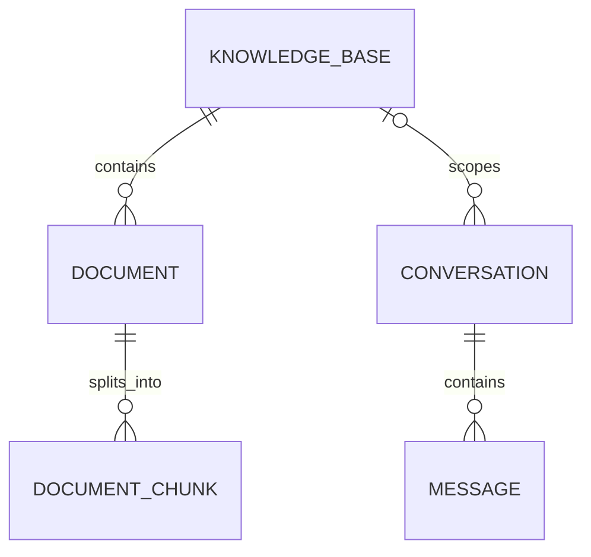

# 智能故障诊断助手

基于 RAG 的设备故障诊断系统。项目将逐步支持维修手册解析、混合检索、引用溯源、
多轮故障诊断和结构化排查建议。

## 当前功能

- FastAPI 后端基础结构
- 环境变量配置
- 统一 API 响应格式
- 统一异常处理
- 健康检查接口
- SQLAlchemy 2 异步数据库访问
- Alembic 数据库版本迁移
- 知识库创建、分页、详情、更新和删除接口
- 知识库、文档、切片、会话和消息核心数据模型
- 接口与数据库隔离测试

## 数据模型



- 删除知识库时，其文档和切片会级联删除。
- 删除知识库后，历史诊断会话仍然保留，知识库关联被置空。
- 删除会话时，其消息会级联删除。

## 本地运行

```powershell
conda activate fault-rag
Set-Location "D:\python project\rag"
python -m pip install -r backend/requirements-dev.txt
python -m alembic -c backend/alembic.ini upgrade head
python -m uvicorn app.main:app --app-dir backend --reload
```

启动后访问：

- Swagger: <http://127.0.0.1:8000/docs>
- 健康检查: <http://127.0.0.1:8000/api/v1/health>

## 知识库接口

| 方法 | 路径 | 说明 |
| --- | --- | --- |
| `POST` | `/api/v1/knowledge-bases` | 创建知识库 |
| `GET` | `/api/v1/knowledge-bases` | 分页查询知识库 |
| `GET` | `/api/v1/knowledge-bases/{id}` | 查询知识库详情 |
| `PATCH` | `/api/v1/knowledge-bases/{id}` | 更新知识库 |
| `DELETE` | `/api/v1/knowledge-bases/{id}` | 删除知识库 |

当前默认使用项目根目录下的 SQLite 数据库 `fault_rag.db`。该文件已被 Git 忽略，
后续部署阶段会通过 `DATABASE_URL` 切换到 PostgreSQL。

## 数据库迁移

应用已有迁移：

```powershell
python -m alembic -c backend/alembic.ini current
python -m alembic -c backend/alembic.ini history
```

修改 ORM 模型后创建并应用迁移：

```powershell
python -m alembic -c backend/alembic.ini revision --autogenerate -m "describe change"
python -m alembic -c backend/alembic.ini upgrade head
```

## 测试与代码检查

```powershell
python -m pytest
python -m ruff check .
python -m ruff format --check .
```
